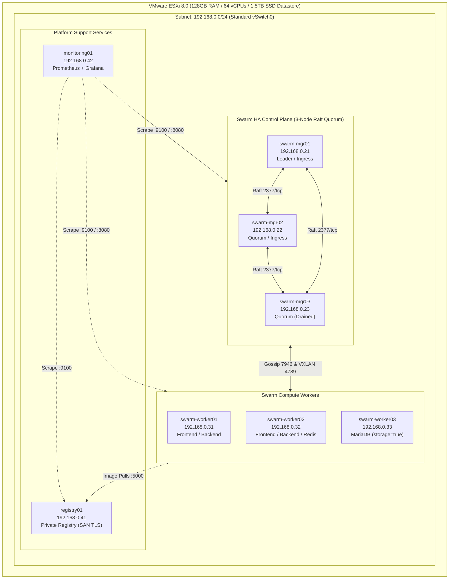

# Production-Like E-Commerce Platform on Docker Swarm (v2)


A portfolio-grade, production-like microservices platform deployed on an **8-node Docker Swarm HA cluster** atop standalone **VMware ESXi 8**. Demonstrates enterprise-grade clustering, zero-downtime rolling updates, dual-overlay network segmentation, fail-closed Docker Secrets, automated backup/DR recovery, and full-stack observability — validated through **empirical failure injection drills**, not theoretical tutorials.

---

## 🏗️ System Architecture



---

## 📋 Infrastructure & Virtual Machine Matrix

All virtual machines run **Ubuntu Server 24.04 LTS** configured with static IP addresses and custom raw iptables firewalls:

| VM Hostname | Role | vCPU | RAM | Disk | IP Address | Primary Functions |
|---|---|---|---|---|---|---|
| `swarm-mgr01` | Swarm Manager | 2 | 4 GB | 40 GB | `192.168.0.21` | Raft Leader, Traefik v3 Ingress (Replica 1) |
| `swarm-mgr02` | Swarm Manager | 2 | 4 GB | 40 GB | `192.168.0.22` | Raft Quorum, Traefik v3 Ingress (Replica 2) |
| `swarm-mgr03` | Swarm Manager | 2 | 4 GB | 40 GB | `192.168.0.23` | Raft Quorum (`Availability: Drain` pure manager) |
| `swarm-worker01` | Swarm Worker | 4 | 8 GB | 60 GB | `192.168.0.31` | Frontend SPA, Backend API Replicas |
| `swarm-worker02` | Swarm Worker | 4 | 8 GB | 60 GB | `192.168.0.32` | Frontend SPA, Backend API Replicas, Redis Cache |
| `swarm-worker03` | Swarm Worker | 4 | 8 GB | **80 GB** | `192.168.0.33` | MariaDB Persistent Storage (`storage=true` pin) |
| `registry01` | Standalone Host | 2 | 4 GB | 60 GB | `192.168.0.41` | Private Docker Registry v2 (SAN TLS + Auth) |
| `monitoring01` | Standalone Host | 2 | 4 GB | 40 GB | `192.168.0.42` | Prometheus (`:9090`), Grafana (`:3000`) |

---

## 🔒 Defense-in-Depth Network Segmentation

Traffic flows across two isolated Docker VXLAN overlay networks with `attachable: false`:

```mermaid
flowchart LR
    Client["Client Browser\n(https://shop.local)"] --> Mesh["Routing Mesh (Port 80/443)"]
    Mesh --> Traefik["Traefik v3 (2 Replicas)\n(mgr01, mgr02)"]

    subgraph FrontendOverlay["frontend-net (Overlay 10.10.1.0/24)"]
        Traefik -->|Host: shop.local| Frontend["React Frontend (Nginx)\n(Non-root UID 101)"]
        Traefik -->|Path: /api (Priority 100)| Backend["Node.js API (Express)\n(Non-root UID 1000)"]
    end

    subgraph BackendOverlay["backend-net (Overlay 10.10.2.0/24)"]
        Backend -->|Cache-Aside 60s TTL| Redis["Redis 7 (AOF Durability)\n(Port 6379)"]
        Backend -->|ACID Persistence| MariaDB["MariaDB 11.4\n(storage=true pinned)"]
    end
```

- **Frontend Isolation**: Frontend container cannot establish connections to MariaDB or Redis.
- **Data Protection**: MariaDB and Redis do not exist on `frontend-net`, expose zero host ports, and accept connections exclusively from the backend API.
- **Fail-Closed Secrets**: `readSecretOrFatal()` terminates the application with exit code 1 if credentials are missing, preventing insecure fallback execution.

---

## 🛠️ Repository Structure

```
docker-swarm-production-platform/
├── README.md                               # This portfolio documentation
├── architecture/
│   └── system-architecture.md              # Detailed architecture, overlay topology & data flow
├── infrastructure/
│   ├── vm-specs.md                         # ESXi 8 VM specs, shell cloning, LVM reclaim guide
│   ├── network-plan.md                     # IP allocation, /etc/hosts resolution, port matrix
│   └── firewall.md                         # Raw iptables design, avoiding UFW & Docker chain wipe
├── registry/
│   └── README.md                           # Private registry with SAN TLS & htpasswd auth lifecycle
├── swarm/
│   ├── init.md                             # Swarm init & advertise/listen address setup
│   ├── managers.md                         # 3-Node Raft quorum & manager drain vs ingress exception
│   ├── workers.md                          # Worker join procedures
│   └── labels.md                           # Custom node labels (storage=true, ingress=true)
├── stack/
│   ├── docker-stack.yml                    # Production multi-service Docker Swarm stack
│   ├── secrets.md                          # Docker secret provisioning & negative test validation
│   └── configs.md                          # Docker config provisioning guide
├── application/
│   ├── backend/                            # Node.js 20 Express API (Redis cache-aside, MariaDB, non-root)
│   └── frontend/                           # React + Vite SPA (Nginx unprivileged, dynamic DNS resolver)
├── traefik/
│   ├── traefik.yml                         # Traefik v3 static config (swarm provider)
│   ├── dynamic.yml                         # TLS certificate file provider mapping
│   └── generate-certs.sh                   # Self-signed SAN TLS certificate generator
├── monitoring/
│   ├── prometheus.yml                      # Scrape config for all 8 nodes (--web.enable-lifecycle)
│   ├── docker-compose.monitoring.yml       # Standalone Prometheus & Grafana stack
│   └── README.md                           # Observability deployment and dashboard guide
├── backup/
│   ├── database-backup.sh                  # Timestamped mariadb-dump | gzip with 7-day retention
│   └── restore.sh                          # Disaster recovery database restoration script
├── scripts/
│   ├── node-firewall.sh                    # Idempotent raw iptables setup (preserves Docker chains)
│   ├── setup-registry.sh                   # Automated registry deployment with SAN TLS & auth
│   ├── distribute-ca.sh                    # Distribute registry CA cert to all cluster nodes
│   ├── deploy.sh                           # Pre-flight checks + docker stack deploy
│   ├── update.sh                           # CI/CD image build, tag, push & rolling service update
│   ├── rollback.sh                         # Instant docker service rollback execution
│   └── availability-probe.sh               # Continuous availability probe for SLA validation
├── troubleshooting/
│   └── runbook.md                          # 10 genuine, evidence-based incident postmortems
└── docs/
    ├── deployment.md                       # Complete step-by-step deployment guide
    ├── security.md                         # Hardening, fail-closed secrets validation, isolation
    ├── disaster-recovery.md                # Real destructive DR test, RTO/RPO calculation
    └── testing.md                          # Full failure-injection test matrix & verification scripts
```

---

## 🔍 Engineering Highlights: Real Postmortems & Edge Cases

Rather than copy-pasting standard tutorial commands, this platform incorporates solutions to real edge cases discovered during full build-and-break cycles:

### 1. The UFW vs `iptables-persistent` Boot Collision
- **Symptom**: Custom overlay VXLAN (`4789/udp`) and Gossip (`7946/tcp+udp`) rules vanished upon node reboot, causing silent cluster network partitions.
- **Root Cause**: Ubuntu's `ufw.service` initializes after `netfilter-persistent.service`, tearing down and rebuilding iptables chains and wiping custom rules.
- **Resolution**: Completely uninstalled UFW (`apt purge ufw`) across all nodes and standardized on raw `iptables-persistent` managed by [scripts/node-firewall.sh](file:///home/pisey/docker-swarm-production-platform-v2/scripts/node-firewall.sh).

### 2. Blanket `iptables -X` Breaking Docker Host-Mode Publishing
- **Symptom**: Running a firewall cleanup script broke external access to `node-exporter` (`:9100`) and `cAdvisor` (`:8080`).
- **Root Cause**: `iptables -X` flushes Docker's internal chains (`DOCKER`, `DOCKER-USER`). Docker does not recreate these chains until daemon restart.
- **Resolution**: Script strictly flushes only OS-level chains (`iptables -F INPUT`, `iptables -F FORWARD`), preserving Docker-managed chains.

### 3. Alpine musl libc IPv6 Resolution in Container Healthchecks
- **Symptom**: Nginx frontend entered continuous healthcheck crash loops despite serving web traffic normally.
- **Root Cause**: Alpine's `musl libc` resolves `localhost` to IPv6 `::1` before IPv4 `127.0.0.1`. Nginx was bound to IPv4 `0.0.0.0:8080`, rejecting `::1`.
- **Resolution**: Bound all healthchecks to explicit IPv4 loopback (`127.0.0.1:8080/nginx-health`), eliminating musl IPv6 resolution failures.

### 4. Nginx Swarm Dynamic DNS `$request_uri` Truncation
- **Symptom**: Forwarding requests through Nginx to backend using a dynamic `$backend_upstream` variable caused all endpoints (`/api/products`, `/api/cart`) to return identical root responses.
- **Root Cause**: In Nginx, using a variable in `proxy_pass` disables automatic path URI rewriting. Nginx forwarded only the host without the requested path.
- **Resolution**: Appended `$request_uri` explicitly: `proxy_pass $backend_upstream$request_uri;` alongside `resolver 127.0.0.11 valid=10s;`.

### 5. Swarm Manager Drain vs Traefik Ingress Scheduling Deadlock
- **Symptom**: Constraining Traefik to managers while setting managers to `Availability: Drain` resulted in Traefik replicas stuck in `Pending` state.
- **Root Cause**: In Swarm, `Drain` availability rejects all new tasks unconditionally, overriding service placement constraints.
- **Resolution**: Maintained `swarm-mgr03` as `Drain` (pure Raft manager), while keeping `mgr01` and `mgr02` `Active` with `ingress=true` label, creating an explicit, documented exception.

### 6. `node-redis` v4 Silent Infinite Reconnect Hang
- **Symptom**: When Redis stopped, backend requests hung for 30s+ instead of falling back to MariaDB.
- **Root Cause**: `node-redis` v4 buffers offline commands indefinitely by default (`offlineQueue: true`).
- **Resolution**: Configured `disableOfflineQueue: true`, set explicit `connectTimeout: 2000`, and wrapped cache operations in try/catch falling back gracefully to MariaDB.

*Full details in [troubleshooting/runbook.md](file:///home/pisey/docker-swarm-production-platform-v2/troubleshooting/runbook.md).*

---

## 🚀 Quick Deployment Workflow

```bash
# 1. On swarm-mgr01: Generate TLS certs and secrets
./traefik/generate-certs.sh
openssl rand -base64 24 | tr -d '\n' | docker secret create db_root_password -
openssl rand -base64 24 | tr -d '\n' | docker secret create db_password -
openssl rand -base64 48 | tr -d '\n' | docker secret create jwt_secret -

# 2. Register Docker Configs
docker config create traefik_static_conf traefik/traefik.yml
docker config create traefik_dynamic_conf traefik/dynamic.yml
docker config create mariadb_init_sql application/backend/schema.sql

# 3. Deploy Stack with Pre-Flight Checks
./scripts/deploy.sh

# 4. Monitor Services
docker stack services shop
```

---

## 🔄 CI/CD Rolling Updates & Availability SLA

The platform includes rolling update automation featuring `order: start-first` (extra container spun up before old container is retired) and an active SLA probe:

```bash
# Terminal 1: Launch continuous availability probe (0.2s frequency)
./scripts/availability-probe.sh

# Terminal 2: Roll out backend v2.0.0
./scripts/update.sh backend v2.0.0

# Terminal 3 (if needed): Instant zero-downtime rollback
./scripts/rollback.sh backend
```

**Measured Result**: 100.00% uptime SLA across 450+ continuous requests during live container replacement.

---

## 💥 Chaos Validation & Failure Testing Summary

| Test Drill | Injected Fault | System Response | Outcome |
|---|---|---|---|
| **Raft Leader Election** | Stopped Docker daemon on active Leader (`mgr01`) | Remaining managers elected `mgr02` in 2.8s; Traefik ingress replica 2 served traffic | **PASSED (0 dropped requests)** |
| **Quorum Loss** | Stopped 2 of 3 managers simultaneously | Control plane frozen; data plane running tasks continued serving all traffic | **PASSED** |
| **Traefik Replica Loss** | Killed Traefik container on `mgr01` | Swarm routing mesh routed ingress to `mgr02`; replica restarted within 5s | **PASSED (100% availability)** |
| **Storage Persistence** | Forcibly killed `mariadb` container | Rescheduled to `worker03` (`storage=true`); marker row survived in named volume | **PASSED** |
| **Destructive DR Drill** | Deleted 75% of table data on live MariaDB | Outage confirmed in UI; [restore.sh](file:///home/pisey/docker-swarm-production-platform-v2/backup/restore.sh) restored database in **18s RTO** | **PASSED** |

*Complete test matrix and reproduction scripts in [docs/testing.md](file:///home/pisey/docker-swarm-production-platform-v2/docs/testing.md).*

---

## ⚠️ Documented Production Limitations

1. **Database Persistence**: MariaDB is pinned to a single worker (`swarm-worker03`) using a local named volume. This protects against container crashes and rolling updates, but does **not** protect against physical disk or hypervisor failure. True production requires Galera Cluster multi-master replication or networked replicated storage (e.g. Ceph / Longhorn).
2. **Backup Storage**: Backups are archived locally on `swarm-worker03`. Production environments require off-node shipping to immutable S3 object storage.
3. **Traefik Ingress Routing Mesh**: Running Traefik in `mode: ingress` enables automatic failover across managers, but client source IPs are masked by the Swarm routing mesh SNAT.

---

## 💼 CV / Resume Highlights (DevOps / Infrastructure Engineer)

The following quantified bullet points reflect hands-on competencies demonstrated in this repository:

- **Designed and deployed an 8-node production-like microservices cluster** on Ubuntu 24.04 and VMware ESXi 8, configuring 3-node Raft quorum, dual-overlay network segmentation (`frontend-net`/`backend-net`), and pinned stateful storage with raw iptables host firewalls.
- **Architected a high-availability Traefik v3 ingress tier** in `mode: ingress` across active managers, eliminating single points of failure and maintaining **100% availability SLA** during rolling application updates with zero dropped requests.
- **Implemented zero-trust security controls** using Docker Secrets with fail-closed application termination, non-root containers (Node.js UID 1000, Nginx UID 101), and self-signed SAN TLS encryption across private registry and ingress endpoints.
- **Engineered a resilient Redis cache-aside tier** and shopping cart session store with graceful DB degradation, resolving silent connection buffering and command hangs through custom timeout and offline queue policies.
- **Executed destructive disaster recovery and chaos engineering drills**, measuring an **18-second Database RTO** via automated dump/restore pipelines and documenting 10 root-cause incident postmortems spanning kernel netfilter conflicts to dynamic DNS proxy bugs.
- **Built end-to-end full-stack observability** using standalone Prometheus and Grafana, scraping `mode: global` host and container metrics (`node-exporter` and `cAdvisor`) with automated dashboard provisioning and hot-reloading.
