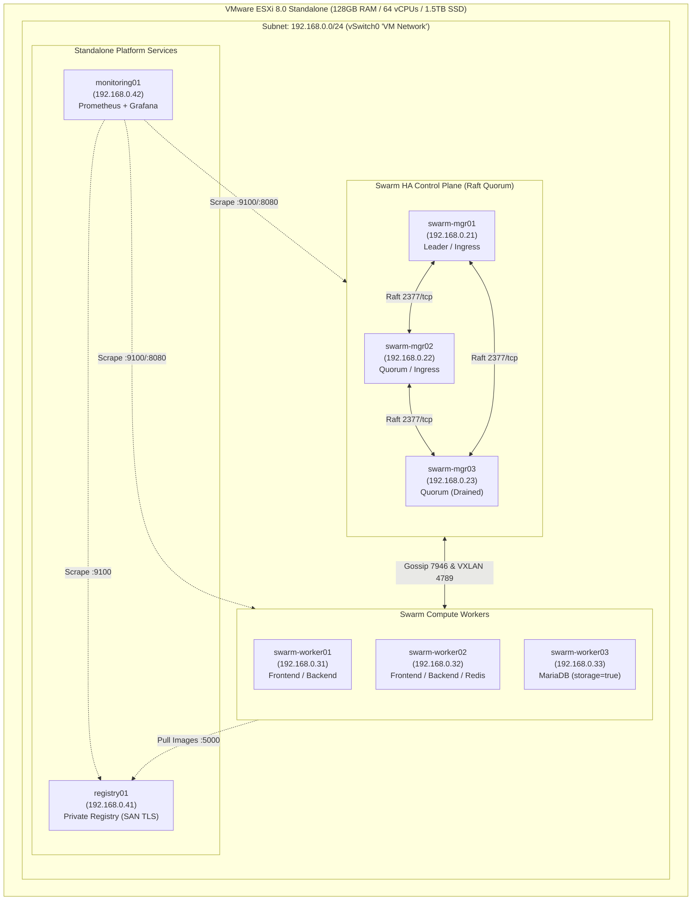

# System Architecture & Topology

This document details the hardware infrastructure, hypervisor virtualization layer, Docker Swarm clustering model, network segmentation, and data durability topology.

---

## 1. High-Level System Architecture



---

## 2. Ingress & Overlay Network Flow

```mermaid
flowchart TD
    Client["Client Browser (HTTPS / shop.local)"] --> IngressMesh["Docker Swarm Routing Mesh (Port 80/443)"]

    subgraph IngressTier["Ingress Tier (node.labels.ingress == true)"]
        IngressMesh --> Traefik1["Traefik v3 Replica 1 (swarm-mgr01)"]
        IngressMesh --> Traefik2["Traefik v3 Replica 2 (swarm-mgr02)"]
    end

    subgraph OverlayFrontend["frontend-net (Overlay 10.10.1.0/24)"]
        Traefik1 -->|Host: shop.local| Frontend["React SPA (Nginx Unprivileged :8080)"]
        Traefik2 -->|Host: shop.local| Frontend
        Traefik1 -->|Path: /api (Priority 100)| Backend["Node.js API (:3000)"]
        Traefik2 -->|Path: /api (Priority 100)| Backend
        Frontend -.->|Dynamic Proxy /api| Backend
    end

    subgraph OverlayBackend["backend-net (Overlay 10.10.2.0/24)"]
        Backend -->|Cache-Aside 60s TTL| Redis["Redis 7 (AOF Durability)"]
        Backend -->|ACID Persistence| MariaDB["MariaDB 11.4 (:3306)"]
    end

    subgraph StorageTier["Persistent Storage Node (swarm-worker03)"]
        MariaDB --> NamedVol[("Named Volume: mariadb-data\n(/var/lib/mysql)")]
    end
```

---

## 3. Core Architectural Decisions & Tradeoffs

| Component | Design Selection | Production Tradeoff / Justification |
|---|---|---|
| **Swarm Managers** | 3-Node Quorum (`mgr01`, `mgr02`, `mgr03`) | Tolerates 1 node failure without quorum loss. Minimizes Raft chatter while maintaining high availability. |
| **Ingress Routing** | `mode: ingress` with 2 replicas on managers | Trades client IP visibility for automated failover across managers via the Swarm routing mesh. |
| **Ingress Placement** | `node.labels.ingress == true` on `mgr01` & `mgr02` | Resolves the Swarm Manager Drain deadlock by providing an explicit, minimal exception to run Traefik on managers while keeping app tasks on workers. |
| **Stateful Database** | Pinned to `swarm-worker03` (`storage=true`) | Limits MariaDB to 1 replica on the dedicated storage node. Protects against container failure, but not physical node loss. |
| **Cache Tier** | Redis Cache-Aside with Graceful Fallback | Redis read/write failures do not 500 or hang HTTP requests; backend falls through to MariaDB. Offline queuing disabled to avoid infinite reconnect hangs. |
| **Observability** | Standalone VM (`monitoring01`) | Prevents monitoring failure cascades if Swarm overlay or quorum destabilizes. |
| **Container Security** | Non-root execution (`node`, `nginx`) | Prevents container breakout exploits by running processes with unprivileged UIDs. |
